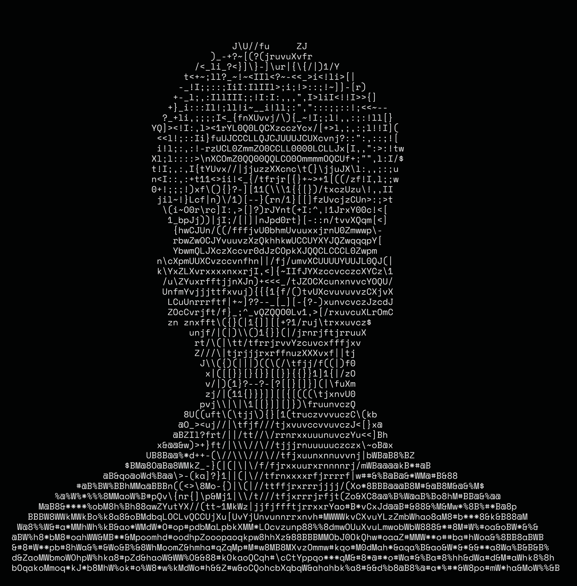

<div align="center">
  <table>
    <tr>
      <td valign="top">
        <!-- Replace this with your actual image file name -->
        
      </td>
      <td valign="top">

```yaml
satyam@github -----------------------------------------------------
OS: ................................ Windows 11, Linux (Lenovo LOQ)
Uptime: .................................... 19 years, 3rd semester
Host: ........................................ NIT Jamshedpur (ECE)
Kernel: ......................... Embedded Systems & Hardware Logic
IDE: .......................... VSCode, Arduino IDE, Vivado/Quartus
Language.Programming: ........................ C++, Python, Verilog
Language.Real: ..................................... Hindi, English

Hardware.Stack: ..................... ESP32, Arduino, Discrete ICs
Hardware.Peripherals: ............. DHT11, RTCs, OLEDs, Vero Boards

Recent.Builds: ......... 8x8 LED Snake Game, ESP32 Smartwatch Proto
Current.Focus: .................. Adv. Computer Architecture, HDLs

Affiliation: ....................... Innoreva (Robotics & IoT Club)
Hobbies.Technical: ................. Home Labs, Circuit Tinkering
Hobbies.Recreation: ................ Stage Dramatics, Chess, Gaming

Contact.Email: .................................. [Your Email Here]
Contact.LinkedIn: ............................ [Your LinkedIn Here]
